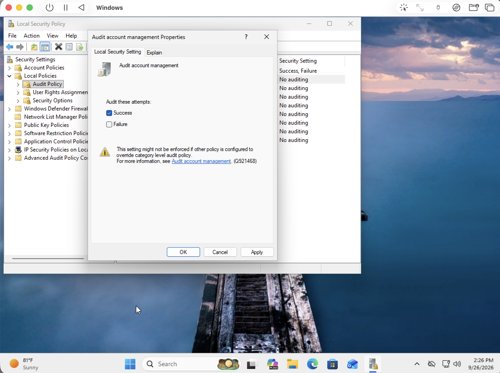
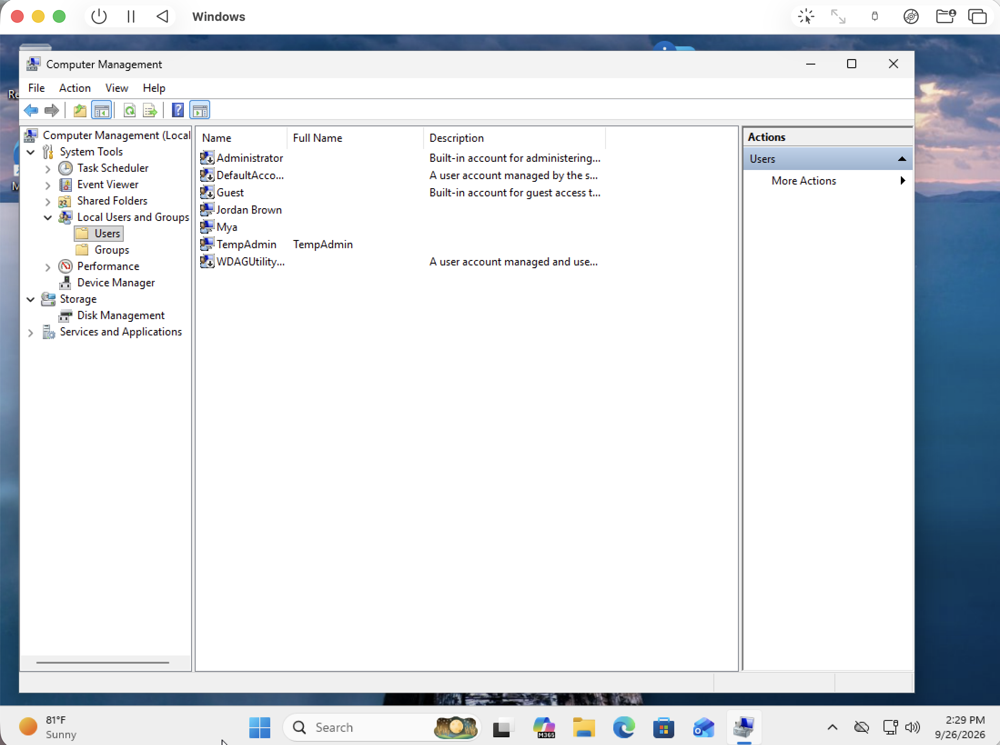
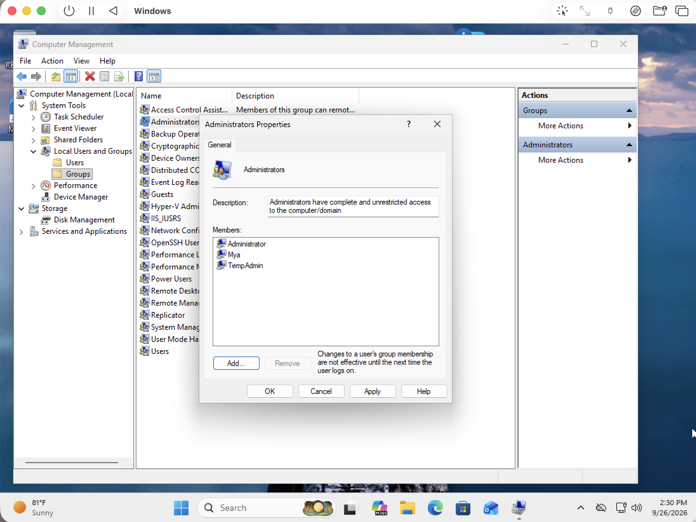
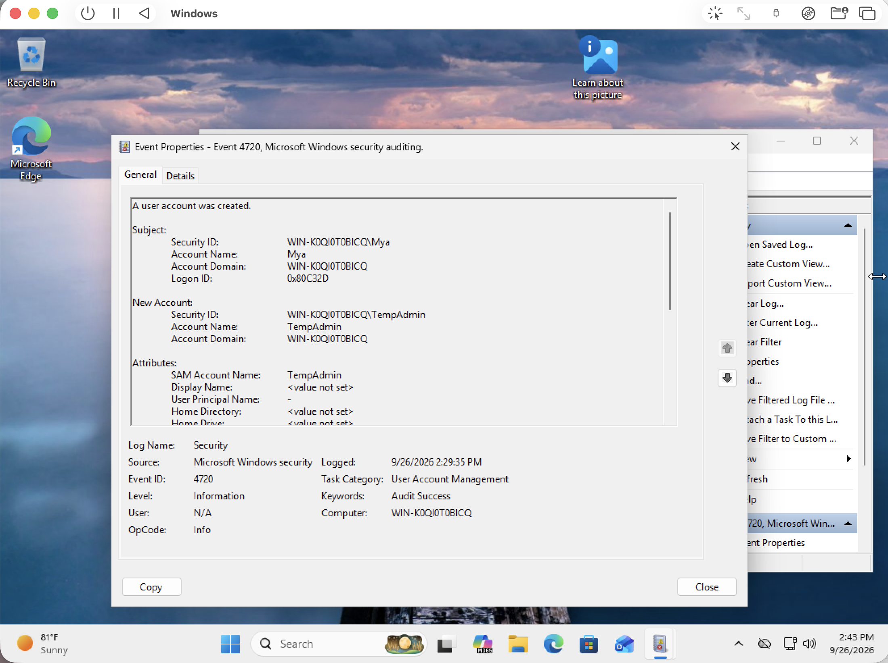
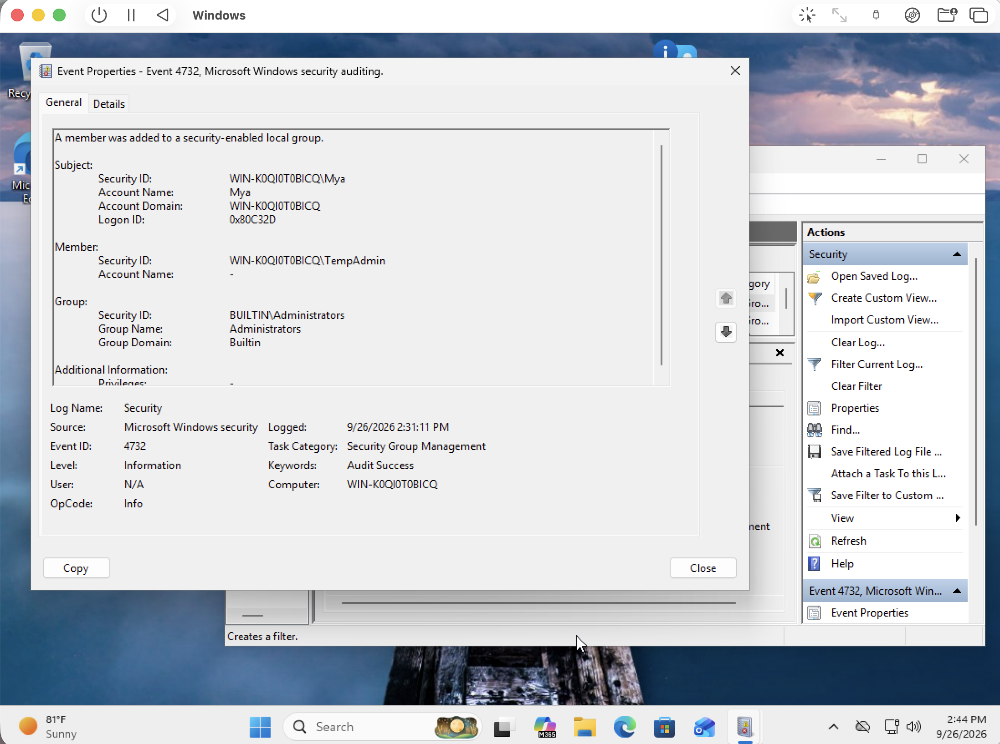

# Incident #002 — Suspicious Local Administrator Account

**Incident ID:** SOC-002  
**Incident:** Suspicious Local Administrator Account  
**Severity:** Medium  
**Status:** Closed  

## Scenario

A new local Windows account named TempAdmin was created and added to the local Administrators group. The activity was investigated using Windows Security event logs to determine when the account was created, which account performed the actions, and whether elevated privileges were assigned.

## Investigation Findings

- Event ID 4720 confirmed that a new local account named TempAdmin was created at 2:29:35 PM.
- The Mya administrator account performed the account creation.
- Event ID 4732 confirmed that TempAdmin was added to the local Administrators group at 2:31:11 PM.
- The Mya administrator account performed the group membership change.
- TempAdmin received elevated administrative privileges less than two minutes after account creation.

## Timeline

- **2:29:35 PM** — TempAdmin account created
- **2:31:11 PM** — TempAdmin added to the local Administrators group

## Conclusion

A new local account named TempAdmin was created and shortly afterward added to the local Administrators group. Windows Security logs confirmed that both actions were performed by the Mya administrator account.

In a real SOC environment, this sequence would warrant investigation because creation of a new account followed quickly by assignment of administrative privileges can indicate unauthorized account creation or privilege escalation.

For this lab, the activity was intentionally generated for testing and was confirmed to be authorized.
## Screenshots

### Account Management Auditing Enabled

### TempAdmin Account Created

### TempAdmin Added to Administrators

### Event ID 4720 — Account Created

### Event ID 4732 — Administrator Group Membership

